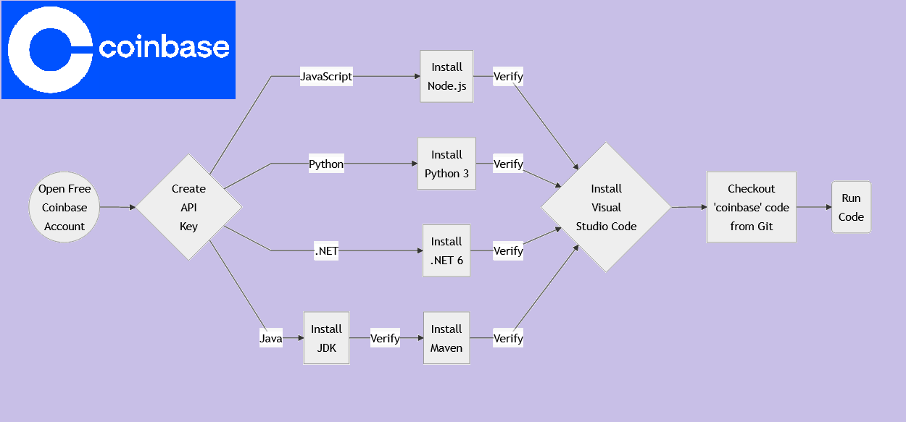

# Crypto Puzzle:  How to Call Coinbase REST API using JavaScript, Python, Java or, C#
Sample REST API client written on various programming languages that shows how to call Coinbase REST API.  Programming languages used are C#, Java, JavaScript & Python.

### Workflow

### References
<ul>
 <li><a href="https://www.coinbase.com/join/islam_w88t">Coin Base Account (Free)</a></li>
 <li><a href="https://code.visualstudio.com/download">Visual Studio Code</a></li>
 <li><a href="https://nodejs.org/en/download/">Node.js</a></li>
 <li><a href="https://www.python.org/downloads/">Python 3</a></li>
 <li><a href="https://dotnet.microsoft.com/en-us/download/dotnet/6.0">.NET SDK 6</a></li>
 <li><a href="https://jdk.java.net/17/">Open JDK 17</a></li>
 <li><a href="https://maven.apache.org/">Apache Maven</a></li>
</ul>

### Tutorial

